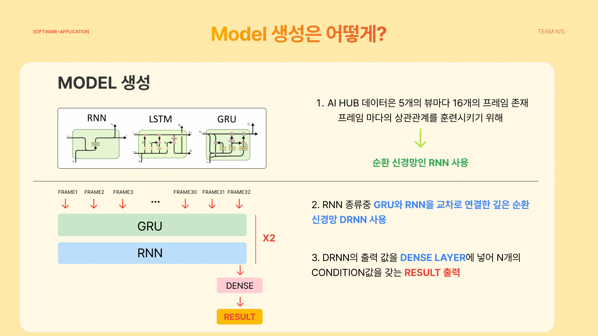
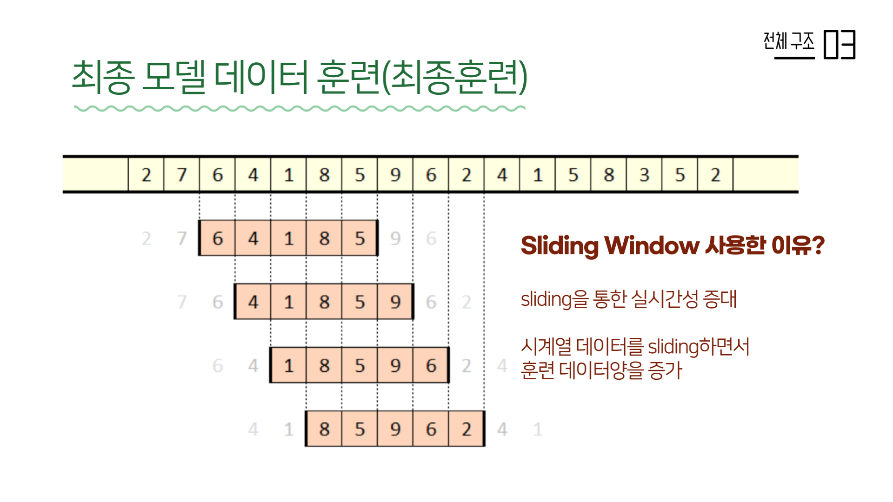

# NPercent

해당 프로젝트는 서울시립대학교 소프트웨어 응용 과목에서 사용한 프로젝트입니다.

[AIHUB](https://aihub.or.kr)에서 '피트니스 자세 이미지' 데이터를 분석하고, 웹캠으로 사람의 포즈 추정을 한 결과를 피트니스 자세 운동의 정확도를 보여주는 프로젝트입니다.

## Example

실제 사용하는 예시입니다.

## Training

